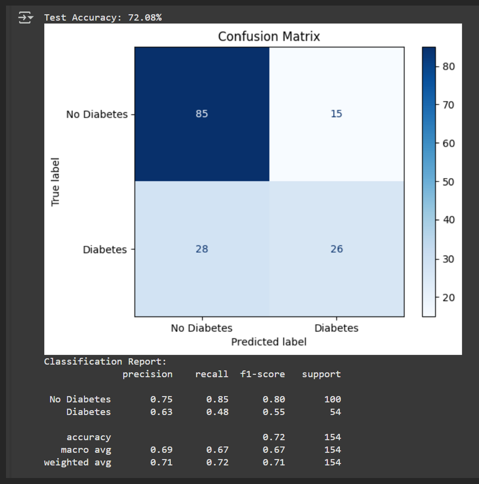
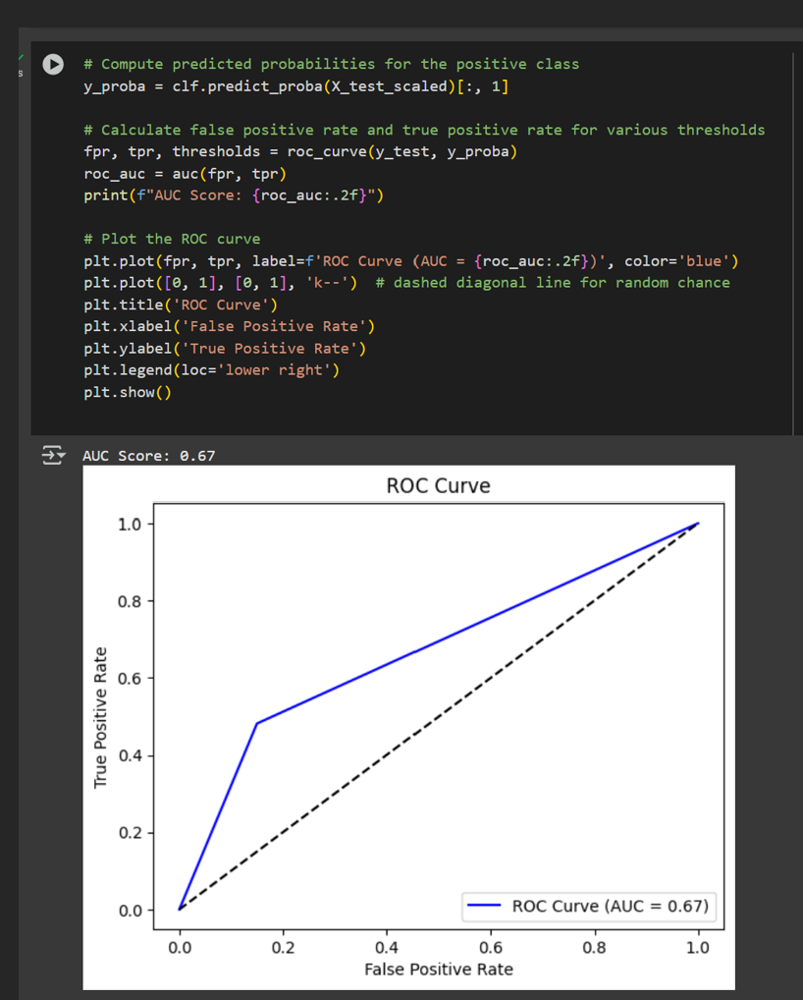

# Data-Analysis-Report
#📊 Diabetes Risk Prediction — Decision Tree (Pima Indians Dataset)

Predicting diabetes risk using a Decision Tree on the Pima Indians Diabetes Dataset (768 records, 8 features + binary target).

## What I did
- Data cleaning: treated physiologically impossible zeros (Glucose, BP, SkinThickness, Insulin, BMI) as missing and imputed with training-set medians.
- Exploratory analysis: class imbalance (~65% non-diabetic), distributions (Glucose, BMI), correlation heatmap.
- Modelling: Decision Tree (stratified 80/20 split, random_state set), optional standardisation for future model comparability.
- Evaluation: accuracy, confusion matrix, full classification report, ROC–AUC.

## Tech Stack
- **Python**: pandas, scikit-learn, matplotlib (and seaborn for EDA)
- Notebook and code included

## Files
- `Python code Colab.ipynb` / `All python code.docx`
- Final report write-up

## Results
- Test accuracy: **~72.1%**
- ROC–AUC: **~0.67**
- Observations: model favours majority (non-diabetic) class; improvement paths include class weighting/oversampling or ensembles (e.g., Random Forest).
- ### Visualisations
#### Confusion Matrix

#### ROC Curve

